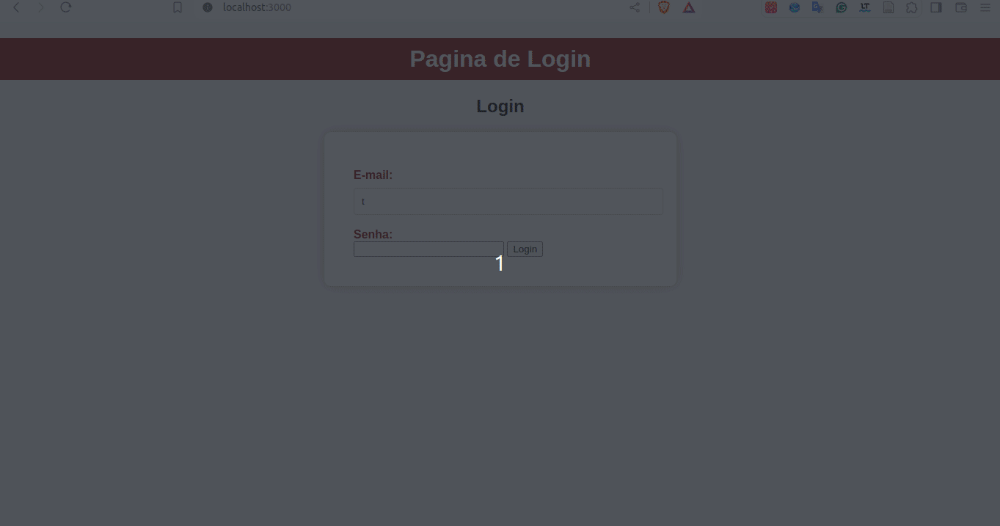

# Prova Banco de dados não-relacionais
Este projeto é referente a 1º prova da disciplina de banco de dados não relacionais

# Configuração
Para rodar este projeto, basta seguir os seguintes passos:

## Node
Para o projeto em node, vá no terminal e digite.

```bash
$ npm init -y
$ npm install
$ nodemons src/server.js
```
OBS.: Se o nodemons não rodr, bastar utilizar esse comando

```bash
$ ./node_modules/.bin/nodemon src/server.js
```

Seu projeto node ficará na url [http://localhost:3000/](http://localhost:3000/)

## Flask
Para o projeto em Flask, vá ao terminal (recomendamos abrir um novo terminal[ou prompt de comando em caso de usar o SO Windows]) e faça os seguintes passos

```bash
$ poetry install
$ poetry shell
$ python app.py
```
OBS.: caso o poetry não inicia o ambiente virtual, basta rodar o python dessa forma.

```bash
$ .venv/bin/python app.py

```

Seu projeto flask ficará na url [http://localhost:5000/](http://localhost:5000/)

# Programa em utilização
Abaixo segue o funcionamento do projeto.



